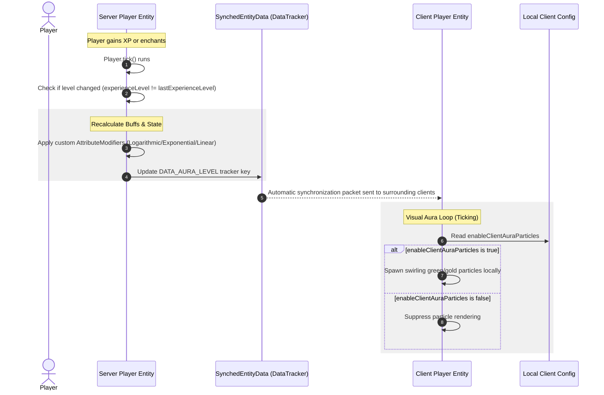

# Architecture Overview

This document describes the architectural flow and synchronization mechanisms used in **Level Does Something** to balance server authority with client performance and visual customizability.

---

## 1. System Execution Flow

The mod's logic is split into a server-side state machine that manages attribute updates, and a client-side visualization system that spawns particles based on data synchronized via Mojang's built-in `SynchedEntityData` (DataTracker).

---

## 2. Component breakdown

### A. State Tracking & Attribute Engine (Server-Side)
- **Target**: `Player.java`
- **Method Hook**: `Player.tick()`
- **Mechanism**:
  - The player's current experience level is evaluated against the `lastExperienceLevel` field.
  - When a difference is detected, the attributes are cleared of the mod's specific modifier UUIDs and replaced with freshly computed modifiers based on the active curve type.
  - Synced data is then updated to ensure surrounding clients are aware of the visual changes.

### B. Synchronization Layer (Mojang DataTracker)
- **Tracker Key**: `DATA_AURA_LEVEL` (registered via `Player.defineSynchedData`)
- **Type**: `Integer`
- **Data Flow**:
  - Automatically synced to all client players within tracking range of the entity.
  - Eliminates the need to serialize custom network packets, reducing server ticking time and mod compatibility issues.

### C. Aesthetic Particle Engine (Client-Side)
- **Ticking Hook**: Client entity ticking handler.
- **Process**:
  - The client reads the `DATA_AURA_LEVEL` tracker value from the player entity.
  - If the level is $\ge 30$, and `enableClientAuraParticles` is true in `level-does-something-client.json`, the client spawns `minecraft:happy_villager` and `minecraft:trial_spawner_detection` particles in an upward spiral centered around the player's bounding box.

### D. Audio Interceptor (Client-Side)
- **Target**: `ExperienceOrb.java`
- **Method Hook**: `playerTouch(Player)`
- **Process**:
  - Intercepts the sound trigger for experience pick-up.
  - If `enableClientSoundPitch` is true in client config, modifies the sound source pitch parameter proportionally based on the player's tracked level.
