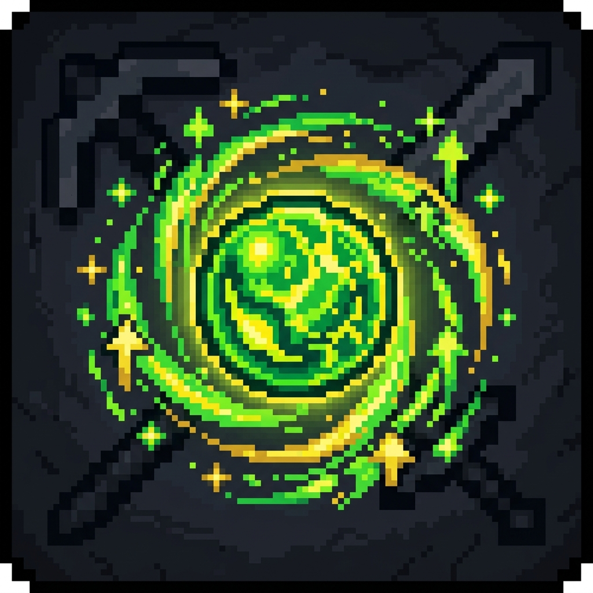

<div align="center">
  
</div>

# 📈 Level Does Something!

**No Backports:** This mod targets **Minecraft 26.1+**. Older versions are unsupported.

> **Stop hoarding levels for nothing. Make your experience level do something.**

**Level Does Something!** translates your experience level points into real passive power. Hoard experience to scale up your break speed, attack damage, movement speed, luck, and maximum health. Complete with custom scaling curves, ambient particle effects, and acoustic milestone chimes.

Part of the **Instant Gratification Collection** — mods that respect the player's time and enhance vanilla loops.

---

## ✨ Features

### 📊 Level-Based Passive Attribute Boosts
Accumulate experience to scale up 5 core player attributes:
- ⛏️ **Block Break Speed**: Mine and harvest blocks faster.
- 🗡️ **Attack Damage**: Strike harder with every melee hit.
- 🏃 **Movement Speed**: Traverse the land quicker.
- 🍀 **Luck**: Get better loot from chests and fishing.
- ❤️ **Max Health**: Earn up to several extra hearts dynamically!

### 📐 Three Scaling Curves
Server operators can select how attributes scale:
- **Smooth Logarithmic** (Default): Fast scaling in early levels, tapering off gracefully for high levels. Prevents players from becoming overly overpowered.
- **Exponential Steps**: Modifiers double at power-of-two milestones (`Level 2, 4, 8, 16, 32...`) up to a configurable max tier.
- **Simple Linear**: A flat, direct multiplier per level.

### 🌟 Ambient Visual Aura & Milestones
- **Ambient Particle Aura**: Reaching Level 30 or higher surrounds you with a swirling aura of gold and green sparkles, visible to everyone.
- **Triumphant Chimes**: Milestone chimes play globally when you cross levels 30, 60, and 100.
- **XP Pitch-Shifting**: Experience orb pickup sounds shift higher in pitch as your level increases.

---

## ⚙️ Configuration (Native Game Rules)

No config files needed on the server. Everything is handled via the native **Edit Game Rules** screen or commands:

```sql
/gamerule leveldoessomething:levelPowerCurveType 1       → 0 = Exponential, 1 = Logarithmic, 2 = Linear
/gamerule leveldoessomething:levelPowerBaseMultiplier 10   → Base scaling factor in basis points (10 = 0.1% per level)
/gamerule leveldoessomething:levelPowerMaxTier 10          → Maximum tier limit for the exponential curve
/gamerule leveldoessomething:levelPowerEnableAura true     → Toggle the ambient visual particle aura
/gamerule leveldoessomething:levelPowerEnableSoundPitch true → Toggle the XP sound pitch-shifts and milestone chimes
```

*Players can locally toggle particle visuals and sound shifts using Cloth Config and ModMenu to accommodate client performance.*

---

## ☕ Support

If you enjoy the **Instant Gratification** collection, consider fueling the next update!

[](https://ko-fi.com/dasikigaijin/tip)
[](https://sociabuzz.com/dasikigaijin/tribe)
[](https://saweria.co/DasikIgaijinn)

> [!NOTE]
> **Indonesian Users:** SocioBuzz and Saweria support local payment methods (Gopay, OVO, Dana, etc.) if you want to support me without using PayPal/Ko-fi!

---

## 📜 Credits

| Role | Author |
| :--- | :--- |
| **Architect** | **Dasik (Rifaditya)** |
| **Collection** | Instant Gratification |
| **License** | GPLv3 |

---

**Modpack Permissions:** You are free to include this mod in modpacks, provided the modpack is hosted on the same platform (e.g. CurseForge). Cross-platform distribution is not permitted.
