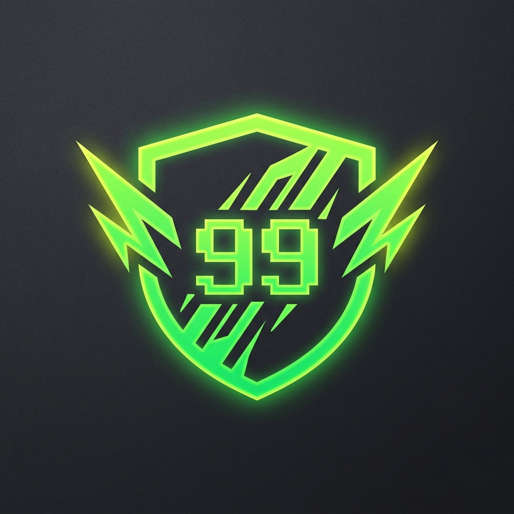

<div align="center">
  
</div>

<p align="center">
    <a href="https://modrinth.com/mod/fabric-api"></a>
    <a href="https://modrinth.com/mod/dasik-library"></a>
    
    
    
</p>

# 📈 Level Does Something!

**No Backports:** This mod targets **Minecraft 26.1+**. Older versions are unsupported.

> **Hoard levels. Gain power. Make your experience level do something.**

**Level Does Something!** rewards players for accumulating experience levels by granting passive, custom-scalable attribute boosts, ambient gold and green swirling aura particles at level 30+, experience collection sound pitch-shifting, and dual-layer configuration toggles (server GameRules and client configs).

Part of the **Instant Gratification Collection** — mods that respect the player's time and enhance vanilla loops.

---

## ✨ Features

### 📊 Level-Based Passive Attribute Boosts
Accumulate experience to scale up 5 core attributes:
- ⛏️ **Block Break Speed**: Break blocks faster as you level up.
- 🗡️ **Attack Damage**: Pack a heavier punch with every level.
- 🏃 **Movement Speed**: Traverse the world slightly quicker.
- 🍀 **Luck**: Improve loot quality in chests and from fishing.
- ❤️ **Max Health**: Accumulate up to several extra hearts!

*Note: Armor, armor toughness, knockback resistance, attack speed, and gravity attributes are deliberately excluded to preserve game balance and armor progression.*

### 📐 Mathematical Scaling Curves
Choose how attributes scale with your level:
- **Exponential Steps** (Curve 0): Modifiers double at power-of-two level milestones (2, 4, 8, 16, 32...) up to a configurable max tier limit.
- **Smooth Logarithmic** (Curve 1 - Default): Fast scaling in early levels, tapering off gracefully for high levels.
- **Simple Linear** (Curve 2): Straightforward constant increment per experience level.

### 🌟 Ambient Visual Aura
Once you reach level 30 or higher, a swirling aura of green (happy villager) and gold (trial spawner) particles emerges around you, indicating your accumulated power to nearby players.

### 🎵 Auditory Milestone Feedback & Pitch Shift
- **XP Pitch Shift**: Experience collection sound pitch increases dynamically with your level.
- **Triumphant Chimes**: Milestone chimes play globally when crossing level 30, 60, and 100.

---

## ⚙️ Configuration

### 🏛️ Server-Wide Control (GameRules)
Server operators can configure the progression curves and global toggles natively in the **Edit Game Rules** screen or via commands:
```sql
/gamerule leveldoessomething:levelPowerCurveType 1       → 0 = Exponential, 1 = Logarithmic (Default), 2 = Linear
/gamerule leveldoessomething:levelPowerBaseMultiplier 10   → Base scaling factor in basis points (10 = 0.1% per level unit)
/gamerule leveldoessomething:levelPowerMaxTier 10          → Maximum scaling multiplier cap under exponential curve
/gamerule leveldoessomething:levelPowerEnableAura true     → Globally enable or disable the ambient particle aura
/gamerule leveldoessomething:levelPowerEnableSoundPitch true → Globally enable or disable the pitch-shifting and chimes
```

### 💻 Client-Side Customization (Local Settings)
Players can locally toggle particle visuals and sound shifts under `.minecraft/config/level-does-something-client.json` or via **ModMenu** and **Cloth Config**:
- `enableClientAuraParticles` (Default: `true`): Turn off local aura rendering to boost client performance or minimize screen clutter.
- `enableClientSoundPitch` (Default: `true`): Disable local pickup sound pitch-shifting.

---

## 📖 Documentation
Detailed guides and references are located in the `Doc/` directory:
- **[Player Guide](Doc/Players/guide.md)**
- **[Technical Index](Doc/doc_index.md)**
- **[Changelog History](Doc/Develop/Changelogs/History.md)**

---

## ☕ Support

If you enjoy the **Instant Gratification** collection, consider supporting future development!

[](https://ko-fi.com/dasikigaijin/tip)
[](https://sociabuzz.com/dasikigaijin/tribe)

---

## 📜 Credits

| Role | Author |
| :--- | :--- |
| **Architect** | **Dasik (Rifaditya)** |
| **Collection** | Instant Gratification |
| **License** | GPLv3 |

---

<div align="center">

**Made with ❤️ for the Minecraft community**

*Part of the Instant Gratification Collection*

</div>
